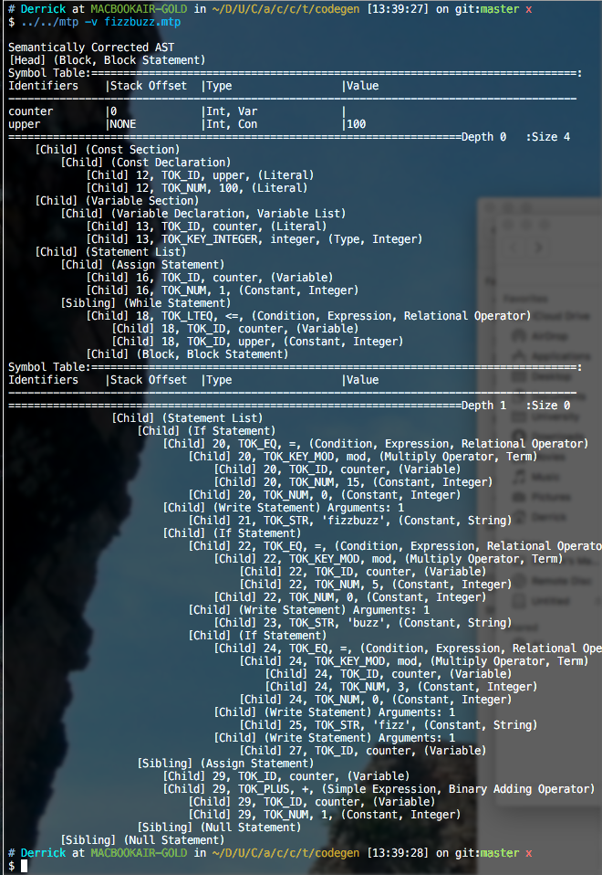

# MacEwan Teeny Pascal Compiler

An LALR(1) compiler for a MacEwan variant of Tiny Pascal school assignment.

- Developed a compiler following a given syntax and semantic documentation (Flex Lexical Analyzer, Lemon Parser, C Language).
- Compiles Teeny Pascal variant to x86 Assembly.
- Does not create any memory leaks nor crashes as shown with unit tests (Bash, Valgrind).

## Dependencies
* Lemon (LALR parser)
* NASM for assembling generated x86 assembler

## Build Instructions

Simply run `make` in the root of the project directory.